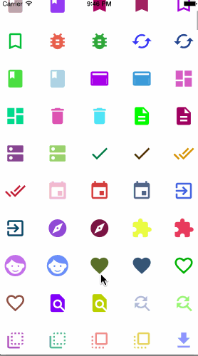
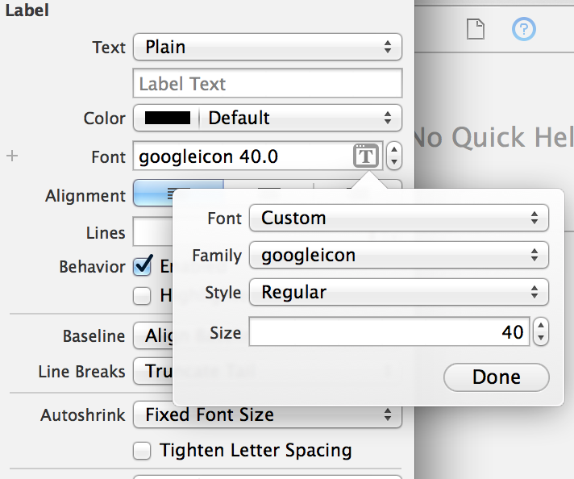

GoogleMaterialDesignIcons
=========================

[](https://developer.apple.com/iphone/index.action)
[](https://developer.apple.com/swift)
[](https://github.com/dekatotoro/GoogleMaterialDesignIcons/issues?state=open)

#Google Material Design Icons Font for iOS
It is based on [https://github.com/google/material-design-icons](https://github.com/google/material-design-icons).  
it converts the material-design-icons svg file in the font file, it was easy to use.  
**You can use the 1661 icons!**  

<br>

  
  

##Benefits of using the Font
- Import is easier to project(Since held together in one file)
- Color easy to change
- Resistant to change size
- Management easier
- Put out in the text as part of the AttributedString
  

##Installation

####CocoaPods
comming soon...

####Manually
Add the `GoogleIcon.swift`, `googleicon.ttf` file to your project.   
info.plist added `Fonts provided by application` key and  
specify the `googleicon.ttf` to Item0 value.

##Usage


Please look at the icon/googleicon.html.   
googleicon.html has been icon code definition.  
The constant of icon code is defined in GoogleIcon class, please use.

```swift

GoogleIcon.e600
GoogleIcon.e601
GoogleIcon.e602
GoogleIcon.e603
...

hogeLabel.font = UIFont(name: GoogleIconName, size: 30.0)
hogeLabel.textColor = UIColor.greenColor()
hogeLabel.text = GoogleIcon.e600

```

You can also be set font in the storyboard.


## Requirements
Requires iOS 7.0.

## Features
- Clipboard copy from Html
- Complete example

## Contributing

Forks, patches and other feedback are welcome.

## Creator

[Yuji Hato](https://github.com/dekatotoro) 
[Blog](http://buzzmemo.blogspot.jp/)

## License
GoogleMaterialDesignIcons is available under the [Attribution 4.0 International](http://creativecommons.org/licenses/by/4.0/) license.
